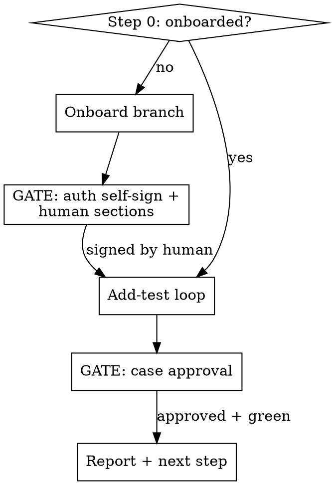

# e2e-kit — one-entry orchestrator for the 4-stage pipeline

## Overview

A **thin router**, not a re-implementation. It detects which stage the
current substrate is in, then invokes the existing pipeline skills
(`exploration` → `write-case` → `automation` → `maintenance`, plus
`sedimentation`) **via the Skill tool** at the right moment, and stops
at the two human gates. It never copies those skills' logic and never
writes cases or spec code itself.

**Core rule:** route and gate — delegate the actual work to the stage skills.

## When to use / NOT use

- **Use:** the user explicitly invoked the kit (see description triggers)
  and wants the flow driven for them.
- **NOT use:** they named one specific stage ("just fix this failing
  test" → go straight to `maintenance`; "write the case only" →
  `write-case`). Don't wrap a single-stage ask in the whole pipeline.

## Step 0 — detect substrate state (always first)

Check the CURRENT working directory (the substrate, not this kit):

- `tests/app.context.md` exists AND a framework slot
  (`.claude/skills/<framework>/SKILL.md`) exists → **onboarded**.
- Either missing → **not onboarded**.

If you cannot tell, **stop and ask** — do not assume.

## Routing

### Onboard branch (not onboarded)

1. Point the user at `docs/ONBOARDING.md` Phases 0–2; confirm the
   framework slot (Phase 1) is in place — if not, that is human/Phase-1
   work, stop and ask.
2. **REQUIRED SUB-SKILL:** invoke `exploration` to fill the `probe` /
   `probe+human` sections of `tests/app.context.md`.
3. 🚪 **GATE — do NOT pass yourself:** the Auth-strategy human marker and
   the human-authored sections (Product summary, State machines, Known
   quirks, External systems, Out of scope) must be signed/written by the
   user. Present what's missing and stop.
4. Once signed → fall into the add-test loop.

### Add-test loop (onboarded)

1. Gather the feature (one sentence) + acceptance criteria. Missing →
   stop and ask; never invent fields/routes/validators.
2. **REQUIRED SUB-SKILL:** invoke `write-case` → produces a
   `tests/cases/<feature>.md` at `status: pending-approval`.
3. 🚪 **GATE — human approval, never self-approve:** run
   `e2e-ai-kit lint case <file>`, show the case + lint result, and ask
   the user to approve. Stop until they do.
4. Approved → **REQUIRED SUB-SKILL:** invoke `automation` → generate
   spec + page object, iterate `npx playwright test` to green.
5. If a previously-green spec is now red → **REQUIRED SUB-SKILL:**
   invoke `maintenance` to classify (auto-fix / propose-diff / file-bug)
   before touching it. Don't blind-fix.
6. If the run emitted a `discoveries.log` → offer **`sedimentation`** to
   persist each learning so it's never re-discovered.
7. Report what was produced (case path, spec path, run result) + the
   next action.

## Quick reference — who does what

| Stage          | Sub-skill (invoke via Skill) | Gate                       |
|----------------|------------------------------|----------------------------|
| Probe map      | `exploration`                | auth self-sign + human §   |
| Write intent   | `write-case`                 | human case approval        |
| Generate spec  | `automation`                 | —                          |
| Failure triage | `maintenance`                | —                          |
| Persist quirk  | `sedimentation`              | PR review (sub-skill owns) |

## Common mistakes

- **Re-implementing a stage inline.** Always go through the Skill tool;
  the stage skills carry contract constraints this router must not copy.
- **Passing a gate yourself.** Case approval and auth self-sign are the
  human's — present and stop, every time.
- **Running `automation` on a `pending-approval` or stale case.** Refuse;
  route back to `write-case`/the human.
- **Blind-fixing a red spec.** Classify with `maintenance` first.
